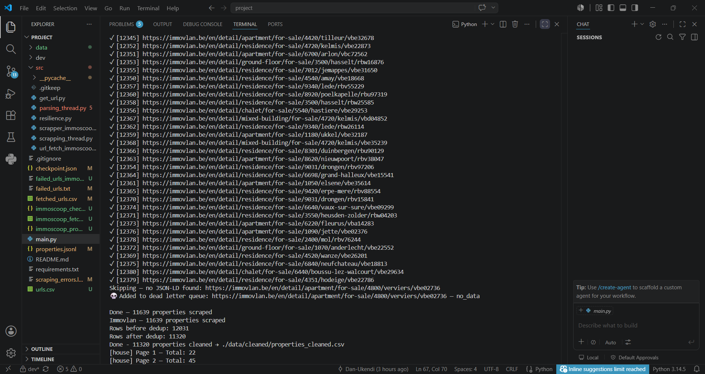
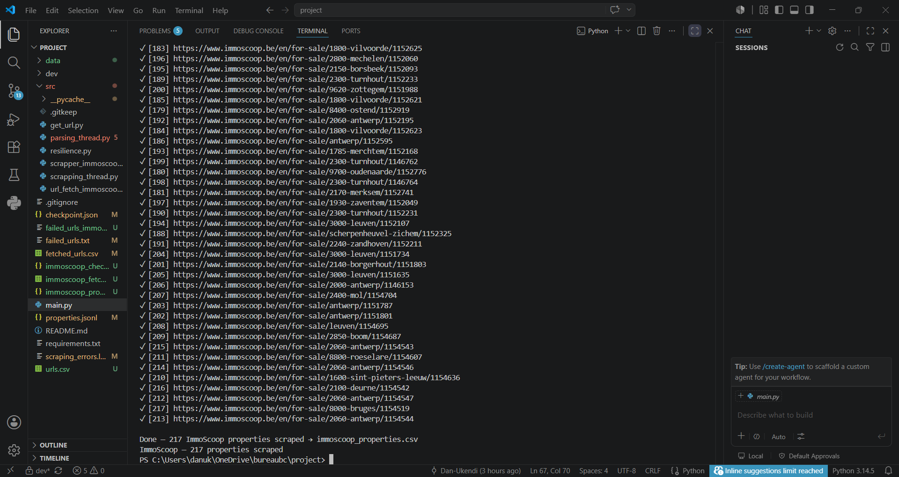

# Immo Eliza – Real Estate Price Prediction Pipeline


**Repository:** immo-eliza-scraping
**Type:** Consolidation & Collaboration
**Duration:** Sprint 1: 5 days
**Deadline:** Sprint 1: 18/06/2026, 4:00 pm
**Team:** 4 teammates

---

## 🧠 Mission Objective

The real estate company "Immo Eliza" wants to develop a machine learning model to make price predictions on real estate sales in Belgium. They hired you to help with the entire pipeline. Immovlan.be is a commonly used website for Belgian properties.

Your first task is to build a dataset that gathers information about at least 10000 properties all over Belgium. This dataset will be used later to train your prediction model.

## 🎓 Learning Objective

- Use Python to collect as much data as possible.
- At the end of this (sub)project, you will:
- Be able to scrape a website
- Be able to build a dataset from scratch
- Collaborate in a team using GitHub Projects
- Use Git in a team setting

## ⚙️ Installation

- pip install -r requirements.txt

## ▶️ Usage
- **🚀How to run?** 
     ### Run the scraper:
     ```bash
        python main.py
-  **🔍What it does?** — Scrapes property listings from Immovlan and Immoscoop
- **📤Output** — Immovlan data is saved in properties_cleaned.csv and Immoscoop data is saved in the properties.jsonl
- **🔧Configuration**
   - We are adding the threads = 50
   - For the 2nd scraper - We can change the number of pages and the targets in the function url_fetch to increase the number of outputs we want.

## ➕ Nice-to-Haves implemented :
**⚡ Performance & Engineering Highlights**
 - Multi-threaded scraping using concurrent.futures (ThreadPoolExecutor) to fetch multiple pages    simultaneously, reducing collection time significantly
- Session persistence via requests.Session() for efficient connection reuse
- Multi-source scraping across Immovlan.be and Immoscoop.be for broader dataset coverage and price validation
- 📍Geo Data (No API)

**🕵️Pipeline Resilience & Anti-bot Stealth**
- Website change and defense mechanism
- Smart User-Agent & Header Rotation

**📍Advanced Data Extraction Geolocation**
- Coordinate capture


## 📦 Repo Architecture & Git Flow

```
immoeliza-scraping/
├── .gitignore
├── 📄README.md
├── 📄requirements.txt
├── 🚀main.py
├── 📁dev/
│   ├── parser.py
│   └── test_scrapping
└── 📁src/
    ├── __init__.py
    ├── get_url.py
    └── parsing_thread.py
    ├── resilience.py
    └── scrapper_immoscoop.py
    └── scrapping_thread.py
    ├── url_fetch_immoscoop.py

```
## 🌿 Git flow and branching strategy 

- **Protected Branches: * main:** Only contains functional, completed code. No one commits directly to main.
- **dev:** The integration branch where team members merge their features to test them together.
- **Feature Branches:** Every new task gets its own branch stemming from dev. - **Use a naming convention:** feature/your-name-task-description (e.g., feature/sam-url-scraper).
- **The PR & Merge Protocol:**
Pull the latest changes from dev before starting.
- Write code on your local feature branch.
- Push your branch to GitHub and open a - Pull Request (PR) targeting the dev branch.
- **Rule of Two:** At least one other team member (preferably the Git Commander) must review the code and approve the PR before it is merged into dev.
- Once dev is completely stable and the 10,000+ dataset is generated, make one final PR from dev into main.

## 👥Collaboration Structure

- Assigning Roles To ensure accountability and smooth collaboration, every team member must take on one of these core roles. 
- **Project Lead (Agile Master):** Manages the GitHub Project board, ensures deadlines are met, keeps meetings short, and helps unblock team members.
- **Git Commander (Repo Manager):** Sets up the repository, enforces the branching strategy, reviews Pull Requests (PRs), and resolves nasty merge conflicts.
- **Documentation Specialist:** Leads the creation of a stellar README.md, documents data dictionaries, and structures the final presentation.
- **QA & Data Architect (1-2 people):** Defines the final data structure (CSV/JSON schema), ensures data types are consistent, and checks for duplicates or missing values during data consolidation.

## 📌 Project Description & Goal

**Immo Eliza** is a data pipeline project built for a Belgian real estate company looking to develop a machine learning model to predict property sale prices across Belgium.

The project is structured as a multi-sprint pipeline:
- **Sprint 1 (current):** Scrape and collect a dataset of at least 10,000 Belgian property listings
- **Sprint 2 (upcoming):** Data analysis & cleaning
- **Sprint 3 (upcoming):** Machine learning model for price prediction


## 📚 Sources
- https://immovlan.be/- (data source)
- https://www.immoscoop.be/en/ (data source)


## 📸 Visuals

**Terminal Output for Immovlan**


**Terminal Output for Immoscoop**



Also if there is broken link, the utput will show that a link is broken!


**📖 Data Dictionary**

| Column | Data Type | Example | Notes |
|--------|-----------|---------|-------|
| **IDENTIFICATION** |
| property_id | str | https://immovlan.be/en | URL unique — primary key |
| property_type | str | apartment | house / apartment |
| property_sub_type | str | villa | villa / bungalow / … |
| **PRICE** |
| price | float | 325000.0 | In euros, None if not available |
| price_type | str | sale | sale / rent |
| **LOCATION** |
| address | str | Rue Branche Planchard 45 4430 Ans | Full address |
| postal_code | int | 1000 | Belgian postal code |
| city | str | Brussels | City name |
| region | str | Wallonia | Flanders / Wallonia / Brussels |
| province | str | Hainaut | Derived from postal code |
| **SURFACE & STRUCTURE** |
| living_area_m2 | float | 85.0 | Livable area in m² |
| total_area_m2 | float | 120.0 | Total land area in m² |
| bedrooms | int | 2 | Number of bedrooms |
| bathrooms | int | 1 | Number of bathrooms |
| floors_total | int | 10 | Total number of floors (building) |
| floor_number | int | 3 | Apartment floor number |
| facades | int | 2 | Number of facades |
| **EXTERIOR & FEATURES** |
| building_year | int | 1995 | Year of construction |
| state_of_the_building | str | normal | State of the building |
| has_garden | int | 1 / 0 | 1 = True / 0 = False |
| garden_area_m2 | float | 50.0 | None if has_garden = 0 |
| has_terrace | int | 1 / 0 | 1 = True / 0 = False |
| has_swimming_pool | int | 1 / 0 | 1 = True / 0 = False |
| kitchen_equipped | int | 1 / 0 | 1 = True / 0 = False |
| has_garage | int | 1 / 0 | 1 = True / 0 = False |
| parking_count | int | 1 | Number of parking spots |
| has_elevator | int | 1 / 0 | 1 = True / 0 = False |
| **CONDITION & PERFORMANCE** |
| furnished | int | 1 / 0 | 1 = True / 0 = False |
| epc_score | str | C | EPC Certificate: A++ to G |


## 👥 Contributors

| Name | Role | GitHub |
|------|------|--------|
| Dan | 🏃 Agile Master | [Dan-Ukendi](https://github.com/Dan-Ukendi) |
| Irene | 📁 Repo Manager | [ireneghioni-glitch](https://github.com/ireneghioni-glitch) |
| Neha | 📝 Documentation Specialist | [Neha-2204](https://github.com/Neha-2204) |
| Victor | 🔍 QA & Data Architect | [VictorCourtois135](https://github.com/VictorCourtois135) |

## 🕒 Timeline

Sprint 1: Data Collection — 18/06/2026
Sprint 2: Data Analysis — TBD
Sprint 3: ML Model — TBD

